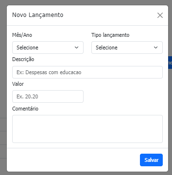
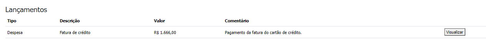

# Finanças em dia

Esta aplicação tem por finalidade auxiliar no controle financeiro mensal apresentando ao usuário um resumo relativo a receitas, despesas e rendimentos.

---
## Como executar o projeto

1. Configurar a Api (back-end) do projeto. Siga as instruções aqui: [back-end](https://github.com/dnz-sara/financasemdia-backend/blob/main/README.md)

2. Clonar ou fazer download do projeto.

3. Abrir o arquivo index.html em qualquer navegador.

---
## Como registrar um lançamento

Basta fazer o download do projeto e abrir o arquivo index.html no seu browser.

1. Clicar no botão "Novo Lançamento"
2. O sistema irá apresentar um popup com os campos a serem preenchidos:

3. Preencher os campos e clicar em no botão "Salvar"

4. Logo após o lançamento será apresentado na listagem da tela principal no respectivo mês selecionado:
 

---
## Como excluir um lançamento

1. Clicar no botão "Visualizar" de um lançamento existente. O sistema apresentará um popup com os dados relativos ao lançamento.

2. Clicar no botão "Excluir".

3. Logo após o usuário será redirecionado a página principal que apresentará já a atualização dos resumos relativos ao mês.

---
## Como editar um lançamento

1. Clicar no botão "Visualizar" de um lançamento existente. O sistema apresentará um popup com os dados relativos ao lançamento.

2. Efetuar as devidas alterações nos campos apresentados e clicar no botão "Salvar".

3. Logo após o usuário será redirecionado a página principal que apresentará já a atualização dos resumos relativos ao mês.

---
## Resumo do mês
O Resumo do mês é a composição da soma de receitas, despesas e rendimento que pode resultar em um resultado positivo ou negativo. Toda vez que um lançamento é incluído, alterado ou removido, o sistema efetua o cálculo automaticamente.